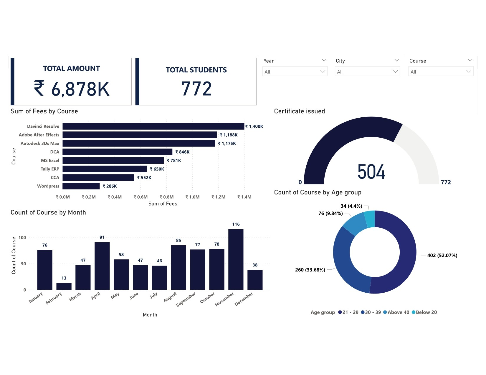

# 📊 Course Institute Dashboard

This dashboard provides an analytical overview of student enrollments, fee collections, certifications, and course performance.  
It is designed to help administrators and stakeholders track institute performance across different courses, cities, and years.

---

## 🔑 Key Highlights
- **Total Students:** 772  
- **Total Fees Collected:** ₹ 6,878K  
- **Certificates Issued:** 504  

---

## 📈 Dashboard Sections

### 1. Certificates Issued
- Displays the total number of certificates distributed.  
- Reflects course completion rates.  

### 2. Students by Age Group
- **21–29 years:** 402 (52.07%)  
- **30–39 years:** 260 (33.68%)  
- **Above 40 years:** 76 (9.84%)  
- **Below 20 years:** 34 (4.40%)  

### 3. Fees Collected by Course
- **Top Revenue Courses:**  
  - Advanced Tally – ₹ 1,188K  
  - DCA – ₹ 1,175K  
  - Adobe After Effects – ₹ 1,157K  
  - Autodesk 3Ds Max – ₹ 846K  
  - MS Excel – ₹ 781K  

### 4. Course Enrollment by Month
- **Highest:** November – 116 courses  
- **Lowest:** January – 13 courses  
- Noticeable spikes: April (91), August (85).  

---

## 📊 Filters Available
- Course  
- City  
- Year  

These filters allow users to drill down and analyze specific dimensions.

---

## 🎯 Insights
- Most students are from the **21–29 age group**, showing strong interest from young professionals.  
- Revenue is mainly driven by **accounting and software-focused courses**.  
- Enrollment peaks in **November** and dips in **January**, suggesting seasonal patterns.  
- Certification issuance is high, highlighting good course completion rates.  

---

## 🚀 Use Cases
- Monitor institute growth and student demographics.  
- Identify high-demand courses for curriculum planning.  
- Optimize marketing campaigns based on seasonal enrollment trends.  
- Track completion rates through certification analysis.  

---

## 📷 Dashboard Preview

---

📌 *This dashboard was created for performance monitoring and strategic decision-making for educational institutes.*
