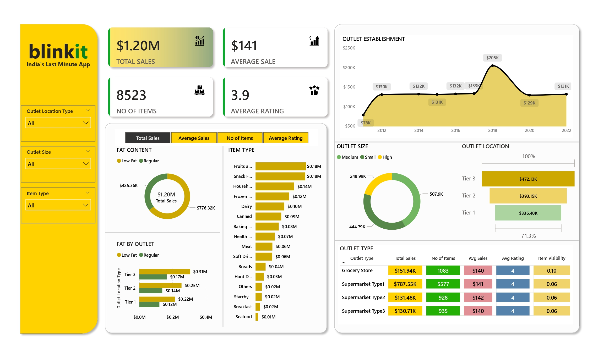

# 📊 Blinkit Sales Dashboard - Power BI

## 🛒 Project Overview

This Power BI dashboard provides a comprehensive visualization of Blinkit's sales performance across various outlet types, sizes, locations, and product categories. It is designed to help stakeholders understand key business metrics and make data-driven decisions.

---

## ✅ Features

- 💰 **Total Sales:** $1.20M across all outlets  
- 🧾 **Number of Items:** 8,523 unique items  
- 💵 **Average Sale Value:** $141 per item  
- ⭐ **Average Rating:** 3.9 out of 5  

---

## 📈 Dashboard Highlights

### 🔹 Sales Breakdown
- **By Fat Content:** Compares low-fat vs regular items  
- **By Item Type:** Visualizes sales across food categories (e.g., Fruits, Snacks, Dairy)  
- **By Outlet Type:** Shows sales, item count, average sale, rating, and visibility  

### 🔹 Outlet Insights
- **Outlet Size:** Categorized into Small, Medium, and High  
- **Outlet Location Type:** Tier 1, Tier 2, and Tier 3 cities  
- **Outlet Establishment Trend:** Sales over time from 2012 to 2022  

### 🔹 Interactivity
- Dynamic filters for:
  - Outlet Location Type  
  - Outlet Size  
  - Item Type  

---

## 📂 Files Included

| File Name       | Description                                 |
|----------------|---------------------------------------------|
| `blinkit.jpg`   | Image snapshot of the Power BI dashboard     |
| `README.md`     | Project overview and usage documentation     |

---

## 📊 Data Insights

- Tier 3 cities contribute the **highest sales**: `$472.13K`
- **Regular fat content** accounts for ~65% of total sales
- Supermarket Type1 leads with **$787.55K** in sales and the most number of items (5,577)
- **Outlet sales peaked in 2018** with **$205K**

---

## 📌 Tools Used

- **Power BI** – for dashboard creation and interactive data visuals  
- **MS Excel / CSV** – assumed data source format for import  

---

## 🛠️ How to Use

1. Open Power BI Desktop.
2. Load the dataset and recreate visuals using the provided design.
3. Use filters on the left pane to analyze different segments.
4. Explore tabs for total sales, average sales, number of items, and ratings.

---

## 📬 Contact

For any queries or collaboration opportunities, feel free to reach out:

**Name:** Niranjan  
**Email:** [your-email@example.com]  
**LinkedIn:** [linkedin.com/in/yourprofile](https://linkedin.com/in/yourprofile)