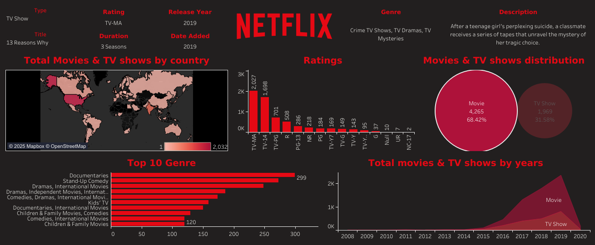

# 📺 Netflix Data Dashboard - Tableau



## 🔍 Project Overview

This project is a data visualization dashboard created using **Tableau** that analyzes Netflix’s vast content library. The dashboard uncovers insights such as the most common content types, popular genres, distribution by country, release year trends, and content ratings.

This is useful for understanding how Netflix distributes its content, what kind of shows or movies dominate the platform, and how its catalog has evolved over the years.

---

## 📊 Key Insights from the Dashboard

- **Total Titles**: 6,234
  - 🎬 Movies: 4,265
  - 📺 TV Shows: 1,969
- **Most Popular Genre**: Documentaries (299 titles)
- **Top Content-Producing Countries**: United States and India
- **Ratings Distribution**: Mostly TV-MA and TV-14 content
- **Yearly Trend**: Huge spike in content additions from 2016 to 2019

---

## 🛠️ Tools & Technologies Used

- **📈 Tableau** – for creating and visualizing interactive dashboards
- **🗃 Dataset** – Netflix Movies and TV Shows Dataset from Kaggle
- **🖼 Dashboard Image** – Exported as PNG for preview

---

## 📈 Dashboard Components

- **Pie Chart** – Distribution between Movies and TV Shows
- **Bar Charts** – Top 10 genres and ratings count
- **Map** – Content availability by country
- **Area Chart** – Number of releases by year
- **Highlight Table** – Example title breakdown (Genre, Description, Rating, Duration)

---

## 📥 How to View the Dashboard

1. Download or clone the repository:
   ```bash
   git clone https://github.com/yourusername/Netflix-Tableau-Dashboard.git
2. Open `Netflix_Dashboard.twb` in **Tableau Desktop** or **Tableau Public**.
3. Explore the visualizations using Tableau’s interactive features.

---

## 🔗 Dataset Source

📊 [Netflix Movies and TV Shows Dataset – Kaggle](https://www.kaggle.com/datasets/shivamb/netflix-shows)

---

## 📌 License

This project is intended for **educational and non-commercial purposes**.  
The dataset is publicly available via **Kaggle** and owned by their respective data providers.

---

## 🙌 Acknowledgments

- [**Kaggle**](https://www.kaggle.com/) – for the open-source Netflix dataset.  
- [**Tableau Public**](https://public.tableau.com/) – for providing powerful data visualization tools.

